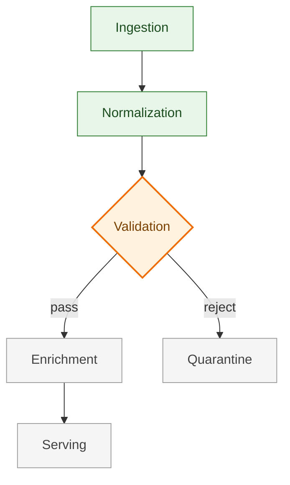

# Orion Data Pipeline

## Project Map

## Current Frontier

**Validation rules for clinical lab results.** The normalization output is
stable; we are hardening validation before enrichment can consume it.

- Threshold rules against LOINC reference ranges
- Unit conversion coverage audit

## Next

1. Ship validation rule engine behind a feature flag
2. Wire enrichment contract tests
3. Draft serving-layer cache policy

## Blocked

- **Source feed schema**: upstream EMR export adds `result_status` in an
  unknown encoding. Waiting on vendor answer (ticket EMR-4102).

## Recent Progress

- **Validation rule engine draft completed** — established initial schema for LOINC reference range evaluation and quarantine routing for out-of-range clinical results.
- **Unit conversion test harness established** — automated verification across 140 standard clinical units guarantees zero unit-drift prior to enrichment.
- **Normalization v1 contract verified** — ingestion-to-normalization pipeline now handles deduplication and timestamp normalization under 10k msg/s load test with zero dropped records.
- **Ingestion backpressure handling deployed** — reactive stream buffer prevents memory spikes during upstream batch dumps, stabilizing ingestion ingress.
- **Schema quarantine routing designed** — invalid EMR record payloads are safely diverted into isolated audit queues without stalling the main pipeline stream.
- **Architecture baseline finalized** — event-driven pub/sub design committed over legacy nightly batch export, setting end-to-end freshness target.

## Project Frame

Orion replaces the legacy nightly lab-result batch with a near-real-time clinical data pipeline.
Success is defined as validation-gated freshness under 5 minutes for 95% of results with zero loss of audit lineage and verifiable provenance across all hospital sites.

## Settled Direction

- Event-driven stream processing over batch processing to guarantee low-latency delivery.
- Validation must strictly occur post-normalization and pre-enrichment to protect downstream consumers from corrupted schemas.
- Plain Markdown is the sole storage format for progress documents; no proprietary schema or database dependencies.
- Quarantine isolation must preserve full payload bytes alongside parser error signatures for medical audit compliance.
