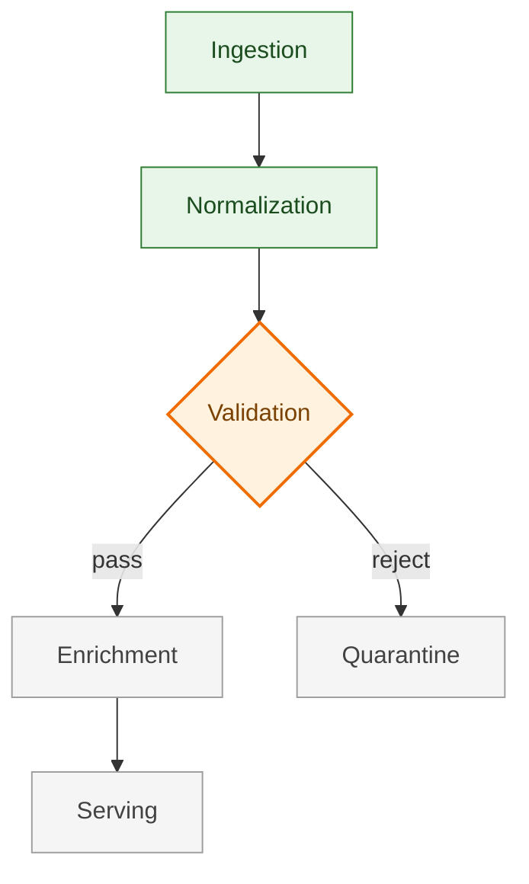

# Orion Data Pipeline

## Project Map

## Current Frontier

**Validation rules for clinical lab results.** The normalization output is
stable; we are hardening validation before enrichment can consume it.

- Threshold rules against LOINC reference ranges
- Unit conversion coverage audit

## Next

1. Ship validation rule engine behind a feature flag
2. Wire enrichment contract tests
3. Draft serving-layer cache policy

## Blocked

- **Source feed schema**: upstream EMR export adds `result_status` in an
  unknown encoding. Waiting on vendor answer (ticket EMR-4102).

## Project Frame

Orion replaces the legacy nightly lab-result batch with a near-real-time
pipeline. Success = validation-gated freshness under 5 minutes for 95% of
results, with zero loss of audit lineage.

## Settled Direction

- Event-driven over batch: settled 2026-07-14.
- Validation happens post-normalization, pre-enrichment: settled 2026-08-02.
- No proprietary DSL for progress docs; plain Markdown only: settled 2026-08-25.

## Recently Completed

- Normalization v1 (units + dedupe) — 2026-08-28
- Ingestion backpressure handling — 2026-08-21
