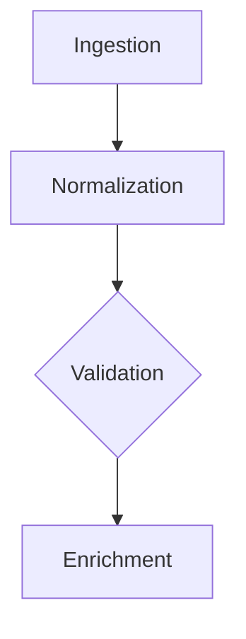

# Cockpit

A local-first project dashboard that renders a single `PROGRESS.md` file into a live, map-centric UI. Write your project status in plain Markdown; Cockpit turns it into an interactive dashboard with Mermaid flowcharts, a "You Are Here" indicator, and auto-refresh on every save.

## Quick Start

```bash
npm install
npm run build
npm run cockpit -- /path/to/your/PROGRESS.md
# → 기본 브라우저가 자동으로 열립니다 (http://127.0.0.1:4321)
```

The viewer watches the file for changes and live-reloads the page automatically via Server-Sent Events — no manual refresh needed.

## Commands

| Command | Description |
|---|---|
| `npm run dev` | Vite dev server (for working on Cockpit itself) |
| `npm run build` | Type-check + production build into `dist/` |
| `npm run preview` | Preview the production build |
| `npm run cockpit -- <file>` | Serve the viewer against a progress file |

### CLI Options

```
cockpit <path/to/PROGRESS.md> [--port <n>] [--no-open]
```

- `--port`, `-p` — port to listen on (default `4321`)
- `--no-open` — do not open the default browser automatically
- The server binds to `127.0.0.1` only (loopback, read-only).
- The default browser opens automatically once the server is ready.

## PROGRESS.md Format

Cockpit expects a Markdown file structured with these `## h2` sections.
Both English and Korean headings are recognized and route to the same panel:

| Section (English) | Section (한국어) | Panel |
|---|---|---|
| `## Project Map` | `## 프로젝트 지도` | Main map |
| `## Current Frontier` | `## 지금 하는 일` | Now |
| `## Next` | `## 다음` | Next |
| `## Blocked` | `## 막힌 것` | Blocked |
| `## Project Frame` | `## 프로젝트 큰 그림` | Project Frame |
| `## Settled Direction` | `## 이미 정해진 방향` | Settled Direction |
| `## Recently Completed` | `## 최근 완료` | Extra context card |

Any additional `## h2` sections are rendered as extra context cards at the bottom of the dashboard.

### You Are Here Marker

Inside a Mermaid block in `## Project Map`, add a comment to highlight the current node:



The node matching the ID (`C` in the example) gets a pulsing accent highlight and a header chip.

## Project Structure

```
cockpit/
├── index.html           # HTML shell with semantic slot layout
├── src/
│   ├── main.ts          # Markdown parsing, section routing, Mermaid rendering
│   └── style.css        # Responsive grid layout, dark mode, "You Are Here" animation
├── scripts/
│   └── serve.mjs        # Loopback HTTP server + SSE file watcher
├── docs/operations/
│   ├── DEVELOPMENT.md   # Development execution contract
│   └── TESTING.md       # Evidence/validation semantics
├── package.json
└── tsconfig.json
```

## Tech Stack

- **TypeScript** + **Vite** — build and dev tooling
- **markdown-it** — Markdown → token stream → HTML
- **Mermaid** — flowchart/diagram rendering
- Vanilla CSS with CSS custom properties, light/dark mode, responsive grid

## License

Private.
